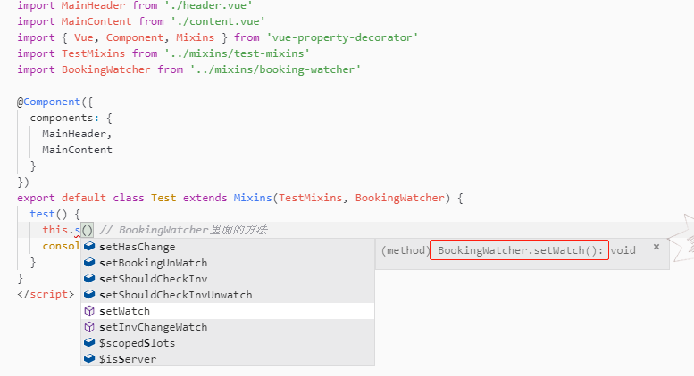

# Vue with typescript

## 最近尝试了一下 TypeScript，试着把一个 Vue 项目改成了 TypeScript 的，感觉还不错

### 目前 Vue 和 TypeScript 的配合还不算很完美，Vuex 和 TypeScript 的配合挺糟糕的，尝试需要谨慎

### 如果想体验一下的话，强烈建议你用 vue-cli 3 直接生成项目目录，这样会少挺多配置，比如配 tsconfig 什么的，在用 vue-cli 的时候选择 TypeScript 就好

如果想自己体验从 0 开始配置请参考这个文档 [TypeScript-Vue-Starter](https://github.com/Microsoft/TypeScript-Vue-Starter#typescript-vue-starter)

这里不提初始配置，因为 vue-cli 已经默认配置好了，在根目录下，有个 tsconfig.json 的文件，在 src 的文件夹下面，有 shims-tsx.d.ts, shims-vue.d.ts 文件

shims-vue.d.ts 这个文件，主要用于 TypeScript 识别.vue 文件，Ts 默认并不支持导入 vue 文件，这个文件告诉 ts 导入.vue 文件都按`VueConstructor<Vue>`处理，因此导入 vue 文件必须写.vue 后缀，但是这样同样的也会造成，就算你写的导入的 .vue 文件的路径就算是错的，静态检测也不会检测到错误，如果你把鼠标放上面你会看到错误的路径就是指向这个文件，因为你定义了这个模块是所有 .vue 后缀的导入都会指向到这个文件，但是如果你的路径是对的，ts 能读出正确的 module。
说那么多可能没用，看一下下面两张图就懂了

shims-tsx.d.ts 文件，这个文件主要是方便你使用在 ts 中使用 jsx 语法的，如果不使用 jsx 语法，可以无视这个，但是强烈建议使用 jsx 语法，毕竟模板是没法获得静态类型提示的，当然，如果你境界高的话，直接用 vue render function。想要使用 jsx 语法的话，配合 babel-plugin-jsx-v-model，这个插件，体验更佳，这个插件在 jsx 语法中实现了 v-model。

### 以上的东西了解一下就好了，基本不用变的

#### 编辑器支持

推荐使用 Visual Studio Code 和 Vetur 插件，如果用的是 IDE，推荐使用 WebStorm

#### 使用 TypeScript 编写 Vue 的时候，主要有两种方法`Vue.extend()` 和 `vue-class-component`

- `Vue.extend()`:使用基础 Vue 构造器，创建一个“子类”。 这种方式最接近 Vue 的单文件组件的写法，如果一个完善 Vue 项目从 JS 改成 TS，用这种方法很快，只要加上 `lang=ts`和一些必要的变量类型就好了，然后用`Vue.extend()`包裹就好。请看下面的例子：  
  JavaScript  
    
  TypeScript  
    
  可以看到基本没什么大的变化

- `vue-class-component`:通常和`vue-property-decorator`一起搭配使用，实际使用只使用`vue-property-decorator`就好了，`vue-property-decorator`是在`vue-class-component`上扩展来的，并且提供了很多修饰器比如 `@Prop`和`@Watch`等等，使用这个可以编写类式组件，但是如果你是完善的项目 JS 改 TS 的话，需要改的地方很多。看一下下面的例子：  
  JavaScript  
    
  TypeScript  
    
  可以看出变化真的很大

#### 这两种编写方式风格有很大的不同，下面具体说一下两种方式的具体实现

- 组件 props

  - `Vue.extend()`实现 props 其实和 JavaScript 没有任何差别，但是如果你需要有 Object 变量类型提示，那就有点不一样了

  - `vue-class-component`实现 props， 需要从 vue-property-decorator 引入 Prop 这个修饰符，使用起来也非常方便，还是用上面的例子

          // JavaScript
          props: ['isVisible', 'title', 'item', 'count', 'items']
          // 如果加入了prop验证，这样写
          props: {
            isVisible: {
              type: Boolean,
              required: true
            },
            title: {
              type: [String, Number]
            },
            item: {
              type: Object
            },
            items: {
              type: Array,
            }
            count: {
              count: Number
            }
          }

          // TypeScript
          /* 这种写法没有任何改变，但是这样没有任何类型提示，这些变量能被TS识别，但是会全部被识别成any，和没类型检查一样 */
          props: ['isVisible', 'title', 'item', 'count', 'items']
          /* 当加入prop验证之后，TS就会提示prop类型了，如果是对象的话，还能有对象的成员提示，写法和JS写法差不多，只是对象类型（包括对象，数组和函数）的有点差别，这样写的话。*/
          // 假设item对象的结构是
          interface Item {
            key: string
            val: string
            num: number
          }
          props: {
            isVisible: {
              type: Boolean,
              required: true
            },
            title: {
              type: [String, Number]
            },
            item: {
              // 注意这里不是
              // Object as Item
              type: Object as () => Item
            },
            itmes: {
              // 注意这里不是
              // Array as Array<Item>
              type: Array as () => Array<Item>
            }
            count: {
              count: Number
            }
          }

          // vue-class-component方式
          import { Vue, Component, Prop } from 'vue-property-decorator'

          // 注意要加非空断言符 ! 不然会报，当然，你定义成any类型当我没说
          /* [non-null-assertion-operator](https://github.com/Microsoft/TypeScript/wiki/What's-new-in-TypeScript#non-null-assertion-operator) 关于非空断言可以参考这个 */
          @Prop({
            required: true
          }) isVisible!: boolean
          @Prop() title!: string | number
          @Prop() item!: Item
          @Prop() items!: Array<Item>
          @Prop() count!: number

- 组件 data computed methods watch

  - `Vue.extend()`实现 data 其实和 JavaScript 没有任何差别，computed 的话，也没什么大的改变，但是有 this 参与运算的必须标明返回值类型，不然会报错， methods 的处理方式和 computed 的一样，有 this 参与运算的必须标明返回值类型，watch 也是一样

  - `vue-class-component`实现 data 的话，直接在类里面写变量就好，computed 的话，写法类似 getter 和 setter，methods 处理方式就是直接在里面写方法，watch 需要从 vue-property-decorator 引入 Watch 这个修饰符

          //一个简单的例子
          // Vue.extend()
          import Vue from 'vue'
          export default Vue.extend({
            data() {
              return {
                count: 1,
                item: {
                  c: '',
                  n: ''
                }
              }
            },
            computed: {
              // 需要标注有 `this` 参与运算的返回值类型
              num(): number {
                return this.count
              },
              name: {
                // 需要标注有 `this` 参与运算的返回值类型
                get(): string {
                  return this.item.n
                },
                set(val: string) {
                  this.item.n = val
                }
              }
            },
            watch: {
              count(newVal: number, oldVal: number): void {
                console.log(newVal)
              },
              'item.n'(newVal: string, oldVal: string): void {
                console.log(newVal)
              },
              item: {
                handler(newV, oldVal) {
                  console.log(oldVal)
                },
                deep: true
              }
            },
            methods: {
              reset(): void {
                this.$emit('reset')
              },
              getKey(): string {
                return this.item.c
              }
            }
          })
        // vue-class-component
        import { Vue, Component, Watch } from 'vue-property-decorator'

        interface KeyValue {
          c: string
          n: string
        }

        @Component
        export default class Test extends Vue {
          // data
          count: number = 1
          item: KeyValue = {
            c: '',
            n: ''
          }

          // computed
          get num(): number {
            return this.count
          }
          get name(): string {
            return this.item.n
          }
          // 注意，这里不能标返回值类型，就算写void也不行
          set name(val: string) {
            this.item.n = val
          }

          // watch
          @Watch('count')
          watchCount(newVal: number, oldVal: number): void {
            console.log(newVal)
          }
          @Watch('item.n')
          watchName(newVal: string, oldVal: string): void {
            console.log(newVal)
          }
          @Watch('item', { deep: true })
          watchItem(newVal: KeyValue, oldVal: KeyValue): void {
            console.log(newVal)
          }
          // methods
          reset(): void {
            this.$emit('reset')
          },
          getKey(): string {
            return this.item.c
          }
        }

- 组件 components

  - `Vue.extend()` components 和 JavaScript 写法完全一致

  - `vue-class-component` 需要把导入的组件写在修饰器@Components({})里面

          // Vue.extend
          import Vue from 'vue'
          import MainHeader from './header.vue'
          import MainContent from './content.vue'

          export default Vue.extend({
            components: {
              MainHeader,
              MainContent
            }
          })

          // vue-class-component
          import { Vue, Component } from 'vue-property-decorator'
          import MainHeader from './header.vue'
          import MainContent from './content.vue'

          @Component({
            components: {
              MainHeader,
              MainContent
            }
          })
          export default class extends Vue {}

- 组件 mixins

  - `Vue.extend()` 并不能完全实现 mixins 多混入的效果，只能混入一个。不推荐混入用这种方式写，无法实现多继承。如果你非要尝试这种写法，可以看看这个[Issue](https://github.com/vuejs/vue/issues/7211)，我没有尝试过这种写法，不过有人写了个例子，可以作为参考，但是我尝试了没成功

        // ExampleMixin.vue
        export default Vue.extend({
          data () {
            return {
              testValue: 'test'
            }
          }
        })

        // other.vue
        export default Vue.extend({
          mixins: [ExampleMixin],
          created () {
            this.testValue // error, testValue 不存在！
          }
        })
        我们需要稍作修改：

        // other.vue
        export default ExampleMixin.extend({
          mixins: [ExampleMixin],
          created () {
            this.testValue // 编译通过
          }
        })

  - `vue-class-component` 能够实现多混入，写法类似类继承

          // mixin1.ts
          import Vue from 'vue'

          export default Vue.extend({
            data () {
              return {
                valFromMixin1: 'test'
              }
            }
          })
          // 不能是
          // 这种写法会报 Mixin1 is not a constructor function type
          export default {
            data () {
              return {
                valFromMixin1: 'test'
              }
            }
          }

          // mixin2.ts
          import { Component, Vue } from 'vue-property-decorator'

          @Component
          export default class Mixin2 extends Vue {
            methodFromMixin2() {}
          }

          // test.ts
          import Mixin1 from './mixin1'
          import Mixin2 from './mixin2'
          import { Component, Mixins } from 'vue-property-decorator'

          export default class Test extends Mixins(Mixin1, Mixin2) {
            test() {
              this.methodFromMixin2()
              console.log(this.valFromMixin1)
            }
          }
          // 如果只混入一个的话，可以这样写
          export default class Test extends Mixin1 {}
          export default class Test extends Mixin2 {}

    这样写不仅不会报错，而且编辑器还有提示
      
    这张图可以看出，setWatch 是 BookingWatcher 里面的方法，实际上，Test 这个类并没有自身的属性，都是从 Vue，BookingWatcher 还有 TestMixins 继承过来的

- 单文件组件

  这个只能用 Vue.extends()，Vue-class-component 无能为力，可以看看这个 [Issue](https://github.com/vuejs/vue-class-component/issues/120)  
  这里提供一个函数式组件的例子  
  

##### 这部分资料参考

[在 Vue 中使用 TypeScript 的一些思考（实践）](https://segmentfault.com/a/1190000015534567)  
[vue 官网 TypeScript 支持](https://cn.vuejs.org/v2/guide/typescript.html)

#### 开发中遇到的一些问题总结

- $refs 报错  
  $refs 报错这个问题相信基本都遇到，除非你真没用到这个，如图：  
    
  报错信息是
  Property 'blur' does not exist on type 'Vue | Element | Vue[] | Element[]'.
  Property 'blur' does not exist on type 'Vue'.

  解决方案：把上图报错部分改成

      // 把这个变量改成定义成HTMLInputElement就好，这里需要用到类型断言
      test() {
        let inputBox: HTMLInputElement = this.$refs.inputBox as HTMLInputElement
         inputBox.blur()
      }

  如果引用的比较多，并且引用里面有自己的组件的话，可以这样写：  
  **$refs: {}**  
    
  这样编辑器还会提示组件里面有什么方法，当你打出 this.$refs.header.时候，编辑器有提示 Header 这个组件里面的属性和方法
